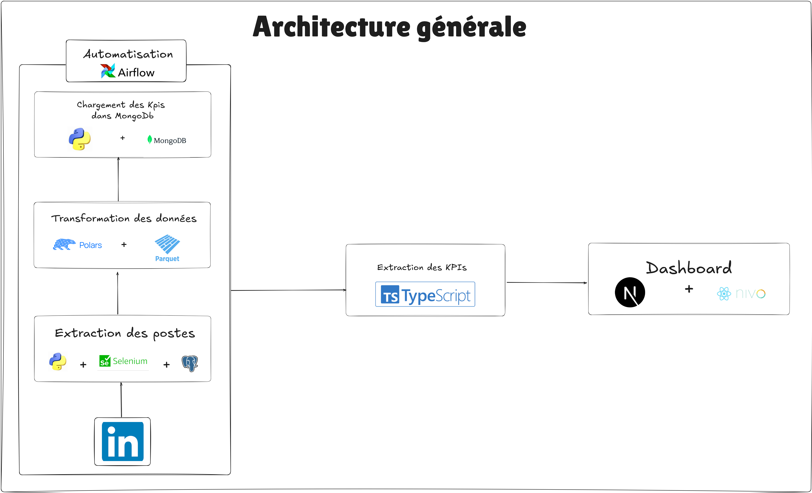

# Analyse des Performances des Posts LinkedIn

## 📜 Description du Projet

Ce projet vise à analyser les performances des publications sur LinkedIn pour identifier les facteurs clés qui maximisent l'engagement et la viralité des posts. En exploitant des données scrapées directement depuis LinkedIn, le pipeline extrait, transforme et analyse les informations (thèmes, hashtags, moments de publication, longueur des posts) pour calculer des KPI exploitables. Ces KPI permettent de répondre à des questions stratégiques : sur quels thèmes publier, quels hashtags utiliser, quelle longueur adopter, et quand publier pour optimiser l’impact.

Le pipeline est automatisé avec **Apache Airflow** pour un rafraîchissement quotidien des données, intégrant des étapes de scraping, validation, stockage (PostgreSQL et MongoDB), et analyse avancée (segmentation DBSCAN). Les résultats sont visualisés via un tableau de bord interactif Next.js, disponible dans un dépôt séparé :  
[**LinkedIn Performance Dashboard Repository**](https://github.com/your-username/linkedin-performance-dashboard)

---

## 📊 KPI Calculés

Les KPI suivants ont été calculés pour guider la stratégie de publication sur LinkedIn :
- **Thèmes viraux** : Fréquence des thèmes comme `WorkplaceCulture`, `DigitalTransformation`, `Leadership`, `IA`, et `Tutoriel`.
- **Hashtags stratégiques** : Popularité des hashtags comme `#digitaltransformation`, `#leadership`, `#ai`, et `#workplaceculture`.
- **Moments optimaux** : Engagement moyen par jour et période (par exemple, mercredi soir : 530.5, vendredi fin de journée : 359.7).
- **Longueur des posts** : Longueur moyenne des posts à fort engagement (~215 mots) vs faible engagement (~165 mots).
- **Segmentation des posts** : Clusters identifiés via DBSCAN pour révéler des patterns spécifiques (par exemple, posts narratifs ou tutoriels techniques).

Ces KPI permettent d’optimiser le contenu, le timing, et le ciblage des publications pour maximiser l’engagement et la visibilité.

---

## 🛠️ Architecture du Pipeline

Le pipeline est conçu pour collecter, traiter, et analyser les données LinkedIn de manière automatisée. Voici les étapes principales :

1. **Scraping des données** : Collecte des posts, engagements, thèmes, et hashtags depuis LinkedIn avec Python, Selenium, et BeautifulSoup.
2. **Première transformation** : Nettoyage et structuration des données, sauvegardées temporairement en fichiers `.parquet`.
3. **Validation des données** : Vérification de l’intégrité (valeurs manquantes, formats, doublons) pour garantir la qualité.
4. **Stockage dans PostgreSQL** : Chargement des données validées dans une base PostgreSQL pour un stockage structuré.
5. **Extraction vers Parquet** : Exportation des données PostgreSQL vers des fichiers `.parquet` pour les traitements ultérieurs.
6. **Deuxième transformation et calcul des KPI** : Calcul des KPI avec Polars, visualisations intermédiaires avec Plotly, et stockage des résultats dans MongoDB.
7. **Automatisation** : Orchestration quotidienne du pipeline avec Apache Airflow pour scraper et mettre à jour les données.
8. **Segmentation DBSCAN** : Analyse des clusters pour identifier des patterns non détectés (par exemple, types de posts engageants).

---

## 🖼️ Architecture Finale



---

## 🚀 Mise en Place du Pipeline et Automatisation

### Prérequis

- **Python 3.10+** installé.
- **PostgreSQL** : Une instance configurée (locale ou cloud, par exemple, Neon).
- **MongoDB** : Un cluster configuré (par exemple, MongoDB Atlas) avec une base `linkedin_kpi_db`.
- **Apache Airflow** : Installé localement ou sur un serveur.
- **Dépendances Python** : Listées dans `requirements.txt`.
- **Navigateur compatible avec Selenium** : Chrome ou Firefox avec le driver correspondant (par exemple, ChromeDriver).

### Étape 1 : Cloner le Projet

Clonez le dépôt contenant les scripts du pipeline :
```bash
git clone https://github.com/Martial2023/Linkedin-Performance-Analytics-Pipeline
cd linkedin-performance-pipeline
```

### Étape 2 : Installer les Dépendances

Installez les dépendances Python à partir de `requirements.txt` :
```bash
pip install -r requirements.txt
```

Contenu de `requirements.txt` :
```
scikit-learn
pymongo
pandas
sqlalchemy
psycopg2-binary
polars
plotly
selenium
beautifulsoup4
requests
webdriver-manager
apache-airflow
```

### Étape 3 : Configurer les Variables d’Environnement

Créez un fichier `.env` dans le répertoire racine ainsi que dans le dossier 'airflow_dags' et ajoutez les variables suivantes :
```
# Connexion MongoDB
MONGODB_URI=mongodb+srv://<username>:<password>@<cluster>.mongodb.net/linkedin_kpi_db?retryWrites=true&w=majority

LINKEDIN_USER_NAME=""
LINKEDIN_PWD=""
# Connexion PostgreSQL
DATABASE_URL="postgresql://..."
```

### Étape 4 : Configurer Apache Airflow

1. **Initialiser Airflow** :
   Configurez Airflow et initialisez la base de données :
   ```bash
   export AIRFLOW_HOME=~/airflow
   airflow db init
   ```

2. **Créer un Utilisateur Airflow** :
   ```bash
   airflow users create \
     --username admin \
     --firstname Admin \
     --lastname User \
     --role Admin \
     --email admin@example.com
   ```

3. **Copier le DAG** :
   Placez le fichier DAG (par exemple, `linkedin_pipeline.py`) dans le dossier `~/airflow/dags/` :
   ```bash
   cp dags/linkedin_pipeline.py ~/airflow/dags/
   ```

### Étape 5 : Lancer Airflow

1. **Démarrer le Serveur Web Airflow** :
   ```bash
   airflow webserver --port 8080
   ```

2. **Démarrer le Scheduler Airflow** (dans un autre terminal) :
   ```bash
   airflow scheduler
   ```

3. **Accéder à l’Interface Airflow** :
   - Ouvrez votre navigateur et allez à `http://localhost:8080`.
   - Connectez-vous avec les identifiants créés (par exemple, `admin`).
   - Activez le DAG `linkedin_pipeline` en cliquant sur le bouton "Toggle".

Le pipeline s’exécutera automatiquement tous les jours pour scraper de nouvelles publications LinkedIn et mettre à jour les KPI. Vous pouvez également le déclencher manuellement via l’interface Airflow.

---

## 📈 Dashboard

Pour visualiser les KPI via un tableau de bord interactif Next.js, consultez le dépôt dédié :  
[**LinkedIn Performance Dashboard Repository**](https://github.com/your-username/linkedin-performance-dashboard)

---

## 📝 Conclusion

Ce projet fournit une solution robuste pour analyser les performances des publications LinkedIn, en identifiant les thèmes, hashtags, moments de publication, et longueurs de posts optimaux pour maximiser l’engagement. Le pipeline automatisé avec Airflow garantit des données à jour, tandis que la segmentation DBSCAN révèle des insights avancés. Les KPI calculés permettent aux créateurs de contenu de prendre des décisions éclairées pour optimiser leur stratégie sur LinkedIn.

---

## 🤝 Contributions

Les contributions sont les bienvenues ! Si vous souhaitez ajouter de nouveaux KPI, améliorer le pipeline, ou optimiser le scraping, ouvrez une issue ou soumettez une pull request sur le dépôt GitHub.

---

## 📜 Licence

Ce projet est sous licence MIT. Voir le fichier `LICENSE` pour plus de détails.